# ERD — Diagrama de Relacionamentos

## Contexto

Postgres 15 hospedado no Supabase Cloud. ~28 tabelas no schema `public`, 16 enums, 8+ funções SQL `SECURITY DEFINER`, ~95 migrations ativas. RLS habilitado em todas as tabelas de dados.

## Visão geral

```mermaid
graph TD
    auth[(auth.users)]
    auth --> profiles[profiles]
    auth --> user_roles[user_roles]
    auth --> clients[clients]
    auth --> team_members[team_members]
    auth --> client_contacts[client_contacts]

    clients --> projects[projects]
    clients --> charges[charges]
    clients --> documents[documents]
    clients --> support_tickets[support_tickets]
    clients --> proposals[proposals]
    clients --> client_inadimplencia_warnings[client_inadimplencia_warnings]
    clients --> legal_acceptance_log[legal_acceptance_log]
    clients --> client_contacts

    projects --> project_contracts[project_contracts]
    projects --> project_installments[project_installments]
    projects --> project_subscriptions[project_subscriptions]
    projects --> project_next_steps[project_next_steps]
    projects --> project_onboarding_checklist[project_onboarding_checklist]
    projects --> project_validation_rounds[project_validation_rounds]
    projects --> charges
    projects --> timeline_events[timeline_events]
    projects --> documents

    project_contracts --> project_installments
    project_contracts --> project_contract_versions[project_contract_versions]

    leads[leads] --> lead_interactions[lead_interactions]
    leads --> proposals
    leads -.converted_client_id.-> clients

    support_tickets --> ticket_messages[ticket_messages]

    billing_rules[billing_rules] --> billing_templates[billing_templates]
    billing_rules --> billing_actions_log[billing_actions_log]
    charges --> billing_actions_log

    team_members --> team_tasks[team_tasks]

    classDef pivot fill:#472680,color:#fff,stroke:#fff;
    class clients,projects,charges pivot;
```

## Pivots

Três tabelas dominam o grafo (degree alto):

1. **`clients`** — toda operação humana parte daqui.
2. **`projects`** — coração de execução; subentidades em cascata.
3. **`charges`** — coração financeiro; mais triggers e cron tocando.

## Enums

`app_role`, `project_status`, `billing_type`, `invoice_status`, `document_type`, `project_pause_reason`, `pause_source`, `contract_record_status`, `payment_model`, `project_installment_type`, `project_installment_status`, `project_installment_trigger`, `subscription_status`, `document_visibility`, `next_step_owner`, `next_step_status`.

Detalhe completo em [[enums]] e `docs/DATABASE.md`.

## Funções SQL chave

| Função                                                                                                     | Retorno | Função                                     |
| ---------------------------------------------------------------------------------------------------------- | ------- | ------------------------------------------ |
| `has_role(uid, role)`                                                                                      | bool    | check single role                          |
| `is_admin(uid)`                                                                                            | bool    | super OR admin                             |
| `has_any_team_role(uid)`                                                                                   | bool    | qualquer role de equipe                    |
| `has_finance_access(uid)`, `has_comercial_access(uid)`, `has_dev_access(uid)`, `is_admin_or_juridico(uid)` | bool    | domain segregation (PA10–PA19)             |
| `get_client_id_for_portal_user(uid)`                                                                       | uuid    | resolve cliente do usuário portal          |
| `mark_overdue_charges()`                                                                                   | void    | promove pendente → atrasado                |
| `sync_projects_from_blocking_charges()`                                                                    | void    | pausa/retoma projetos                      |
| `sync_financial_blocks()`                                                                                  | void    | wrapper diário                             |
| `reconcile_inadimplencia_warnings()`                                                                       | void    | sincroniza `client_inadimplencia_warnings` |

Detalhe em [[functions]].

## Cron jobs (pg_cron)

| Job                     | Schedule      | Função / Edge fn                                    |
| ----------------------- | ------------- | --------------------------------------------------- |
| Auto-mark inadimplente  | `0 2 * * *`   | `sync_financial_blocks()`                           |
| Invoice reminders       | `0 9 * * *`   | `send-invoice-due`                                  |
| Billing rules           | `0 8 * * *`   | `process-billing-rules`                             |
| Scheduled notifications | `*/5 * * * *` | `process-scheduled-notifications`                   |
| Proposal expiry         | (diário)      | `expire-proposals` + `send-proposal-expiry-warning` |

Detalhe em [[cron-jobs]].

## Storage buckets

- `avatars` — privado, RLS por owner.
- `email-assets` — público, imagens dos templates de email.

## Problemas Identificados

🔴 **`current_stage` (projects) é texto livre** — fragmenta análises.
🟠 **Cascades em DELETE muito agressivos** — projeto apagado some com timeline.
🟠 **Tabelas legadas/redundantes**: `monthly_value`/`project_total_value` em `clients` (legacy).
🟢 **Schema sem versão "documentada" em uma tabela** — só por migrations ordenadas.

## Recomendações

1. Adicionar tabela `schema_meta` com `version`, `last_migration`, `notes`.
2. Padronizar `archived_at` em todas as tabelas críticas; nunca `DELETE` sem audit.
3. Materializar relacionamentos críticos em `views_security_invoker` (já feito em parte).

## Relações

- [[key-tables]]
- [[enums]]
- [[functions]]
- [[cron-jobs]]
- [[../10-security/rls-model]]
- [[../02-domains/clients]]
- [[../02-domains/projects]]
- [[../02-domains/charges]]

## Referências

- `supabase/migrations/`
- `src/integrations/supabase/types.ts`
- `docs/DATABASE.md`
